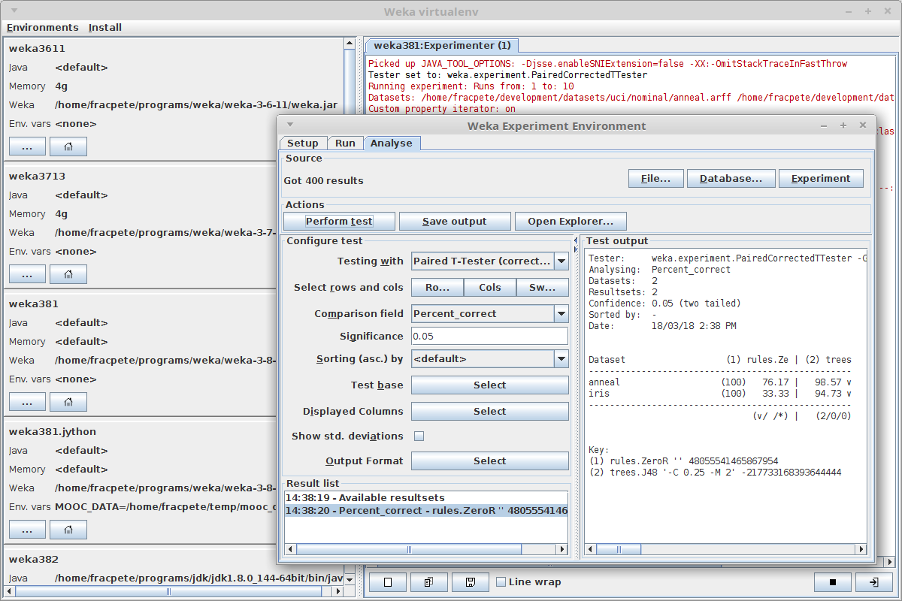
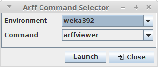

Virtual environment manager for Weka, inspired by the extremely useful virtual 
environments that Python supports.

*weka-virtualenv* can be used for launching the GUI or arbitrary Weka classes.

Since *weka-virtualenv* uses options starting with double-dashes (`--`), clashes with 
Weka options are avoided. Any option that wasn't consumed by *weka-virtualenv* 
will get further processed by the command. E.g., when launching the Explorer
using the `explorer` command, a dataset can be supplied to load immediately, 
or, when executing a classifier using the `run` command, any additional option 
will get passed to the Weka class.

You can use the tool either through the command-line or through its user 
interface.

**Note**
You still need to install Weka yourself, *weka-virtualenv* only helps you
separating your various Weka installations. It is mainly aimed at separating
packages.

## How it works

The tool simply uses existing Weka functionality, namely the `WEKA_HOME`
environment variable, for separating the various environments. 
When launching a class or GUI tool, it launches a new Java process with the
`WEKA_HOME` environment variable pointing to the current environment's
`wekafiles` directory. 

If an environment has no Java or heap size configure (`<default>`), then it 
just uses the system's default settings for launching the new process.

## User interface

You can start the GUI with the following script from the `bin` directory:

* Linux/Mac: `wenvgui.sh`
* Windows: `wenvgui.bat`

## Arff Command Selector

This little tool lets you choose environment and application (Explorer or Arff 
Viewer) to launch, using the provided dataset filenames (e.g., *Open with* from 
the right-click mouse context menu):

* Linux/Mac: `wenvarff.sh`
* Windows: `wenvarff.bat`

## Video

You can find videos for the tool in the following YouTube playlist:

[weka-virtualenv playlist](https://www.youtube.com/playlist?list=PLMeTbrv9G0apt1ii_kyU5rtJEu58WrGwB)

**Windows users** just have to substitute the `wenv.sh` and `wenvgui.sh` scripts
with `wenv.bat` and `wenvgui.bat`. For adding the tool's `bin` directory to
your `PATH` environment variable (to make it available from the command prompt),
follow [these instructions](https://www.computerhope.com/issues/ch000549.htm).
